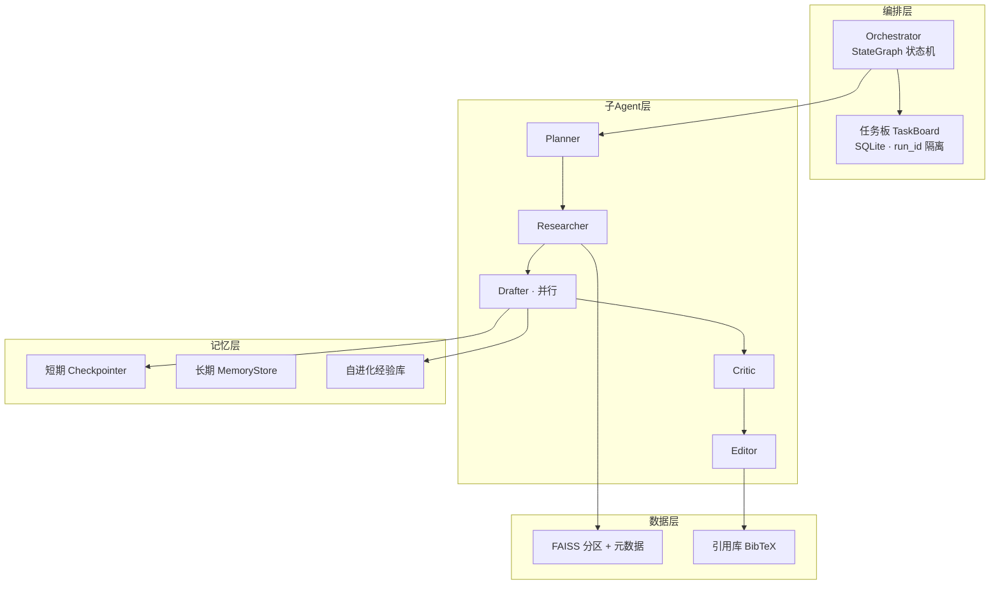

# 基于 LangGraph 的多智能体论文撰写系统（thesis-multiagent）

> 主从协同多智能体 + 本地 FAISS RAG + 三级记忆（短期/长期/自进化）+ 防幻觉引用治理的科研论文写作系统。

输入论文主题，系统自动完成 **规划 → 检索 → 撰写 → 评审 → 修订 → 收尾校验** 的完整闭环，产出论文全文、BibTeX 参考文献与一致性校验报告。

## 核心特性

### 1. 主从多智能体编排（LangGraph）
- 主编排（Orchestrator）不写内容，只负责任务分发与流程驱动，协调 5 个角色子 Agent：

| Agent | 职责 | 模型档位 |
|-------|------|----------|
| Planner | 生成章节大纲、展开任务板 | strong |
| Researcher | 本地 RAG + Web 学术检索，产出带溯源的素材 | medium |
| Drafter | 按章节撰写初稿（可并行多实例） | cheap |
| Critic | 结构化评审（逻辑/引用/结构） | strong |
| Editor | 整合章节、构建引用库、润色 | medium |

- 条件边 `Send` API 按章节依赖并行扇出撰写与评审；SQLite 任务板驱动"评审-修订"闭环（默认 3 轮，超限自动升级人工）
- `run_id` 代际隔离 + `AsyncSqliteSaver` Checkpointer，支持断点续跑

### 2. 本地 RAG 分层检索
- **入库管线**：PDF 解析（保留标题层级与内置元数据）→ 按段落边界分块（约 500 token，10% 重叠，句子对齐）→ BGE-M3 向量化（1024 维）→ FAISS 分片索引 + SQLite 元数据
- **分层检索**：FAISS 粗排 Top-100 → 元数据过滤（年份/子领域）→ bge-reranker 精排 Top-20
- **增量索引**：新论文只重建所属分片，不触碰其他分片
- **Web 补充检索**：arxiv / Semantic Scholar 官方 API，指数退避重试 + 同源限速

### 3. 三级记忆系统
| 层级 | 实现 | 用途 |
|------|------|------|
| 短期记忆 | 对话式上下文 + Checkpointer 持久化 | 修订轮次记忆接续；硬截断 + LLM 压缩摘要两级超窗控制 |
| 长期记忆 | SQLite 命名空间 KV（WAL 并发安全） | 引用库/反馈/经验跨会话存储 |
| 自进化记忆 | 评审教训沉淀 → 撰写时注入 | 按章节类型聚合经验，按重复频次注入提示词，避免重复犯错 |

### 4. 防幻觉引用治理闭环
四道防线，强制每个论断有文献依据：
```
写前限制：Drafter 只能引用素材白名单内的论文
评审核查：Critic 携带素材逐条核对引用
汇总裁决：Editor 过滤离题论文，改写失败上报
收尾校验：规则引擎全文核对 引用 ↔ BibTeX 一一对应 + LLM 结构检查
```

### 5. Web 工作台
FastAPI 统一服务 + Vue 3 前端：实时任务看板（3 秒轮询任务板/记忆库）+ SSE 流式研究助手聊天（支持 `/search`、`/rag` 直调工具与结果收藏）。

## 架构总览



## 技术栈

Python 3.11+ · LangGraph · FAISS · BGE-M3 / bge-reranker · PyMuPDF · SQLite · FastAPI · Vue 3 / Vite · DeepSeek API（OpenAI 兼容协议）

## 快速开始

```powershell
# 1) 安装依赖（uv 管理，国内走阿里云镜像）
uv sync
.venv\Scripts\Activate.ps1

# 2) 配置密钥（DeepSeek 必填）
copy .env.example .env

# 3) 把论文 PDF 放入 data/papers/，入库建索引
thesis-agent ingest --subfield nlp

# 4) 运行论文撰写（相同 thread-id 可断点续跑）
thesis-agent run --topic "论文主题" --venue "目标会议" --thread-id run1

# 5) Web 工作台（默认 http://127.0.0.1:9000）
thesis-agent serve
```

产出物（`data/output/`）：
- `final_paper.md` — 最终论文
- `references.bib` — 参考文献
- `consistency_check.txt` — 一致性校验报告

## 目录结构

```
thesis-multiagent/
├── config.yaml               # 模型分级 / RAG / 编排参数
├── src/thesis_agent/
│   ├── graph/                # LangGraph 编排（orchestrator + 7 类节点 + 任务板）
│   ├── rag/                  # PDF 入库 / FAISS 分片索引 / 分层检索
│   ├── memory/               # 长期记忆 / 对话记忆 / 自进化经验
│   ├── citations/            # BibTeX 管理与引用校验
│   ├── search/               # arxiv / Semantic Scholar 检索
│   ├── llm/                  # 模型分级工厂 + 工具调用
│   ├── chat_api.py           # Web 聊天后端（SSE 流式）
│   └── dashboard.py          # FastAPI 运行看板
├── frontend/                 # Vue 3 工作台（看板 + 聊天）
├── scripts/                  # 入库 / 撰写 / 聊天 CLI 脚本
└── docs/                     # 技术文档 + 问题审查与修复记录
```

## 文档

- [技术文档](docs/技术文档.md) — 完整架构设计、记忆系统、RAG 管线、引用治理实现说明
- [问题审查与修复记录](docs/问题审查与修复记录.md) — 三轮审查迭代修复的 13 项工程问题（并发安全、引用治理、索引重建等）

## 说明

- 本项目仅用于学习与研究，生成内容需人工审核后方可使用
- Windows / WSL2 均可运行；FAISS 中文路径已做兼容处理
