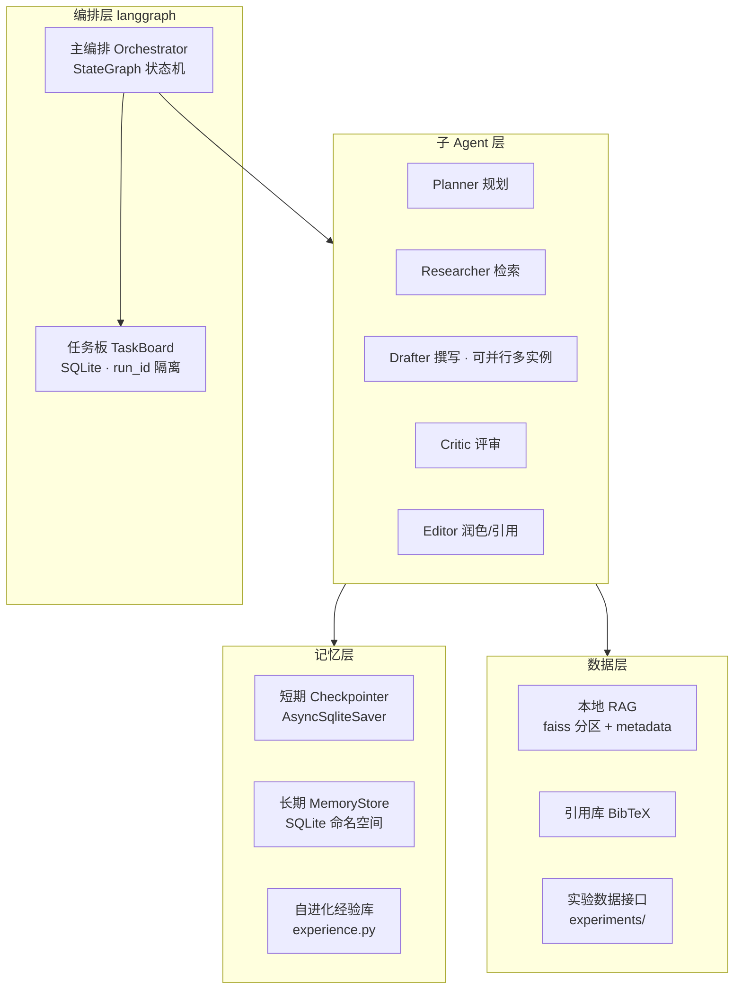
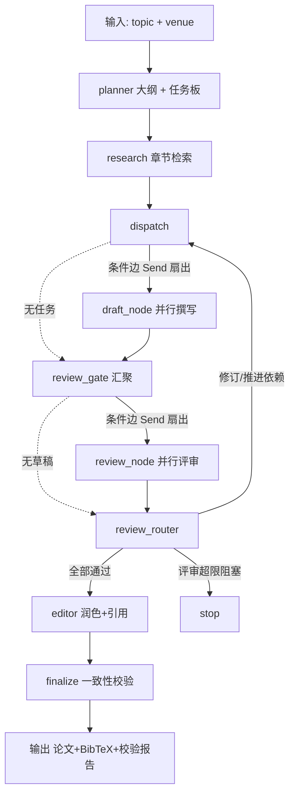
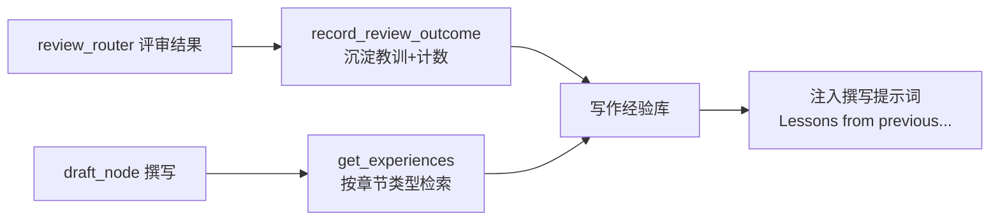

# 论文撰写多 Agent 系统技术文档

> 项目路径:`C:\Users\lmy\Desktop\thesis-multiagent`
> 文档定位:面向研究生论文撰写的多 Agent 系统的完整实现说明,可作为技术路线与后续开发参考。

---

## 1. 系统概述

### 1.1 目标定位

本系统是一个**主从协同的多 Agent 论文撰写系统**,辅助研究生撰写**工科实验型英文论文**。核心目标:

- 把一个"论文主题"自动分解为章节任务,编排多个子 agent 完成**检索 → 撰写 → 评审 → 修订 → 润色 → 一致性校验**的完整闭环;
- 通过**本地 RAG(faiss 向量库)**检索用户本地论文库(500+ 篇),让每个论断都有文献依据;
- 通过**短期记忆(对话状态) + 长期记忆(跨会话) + 自进化记忆(经验沉淀)** 让系统在多次写作中不断进步。

### 1.2 核心能力

| 能力 | 说明 |
|------|------|
| 多 agent 主从协同 | 1 个主编排 + 5 个子 agent(Planner/Researcher/Drafter/Critic/Editor) |
| 动态任务分发 | langgraph `Send` API 按任务板依赖并行扇出章节任务 |
| 评审-修订闭环 | Critic 结构化评审,不通过自动回炉,超限升级人工 |
| 本地 RAG | faiss 分区索引 + BGE-M3 向量化 + bge-reranker 精排,增量入库 |
| 三级记忆 | 短期(状态持久化)/ 长期(命名空间存储)/ 自进化(经验注入) |
| 防幻觉引用 | 每个论断强制挂文献,citation key ↔ BibTeX 一致性校验 |
| 混合模型策略 | 强模型(主/评审) + 便宜模型(撰写),控制成本 |

### 1.3 技术选型

| 组件 | 技术 | 选择理由 |
|------|------|----------|
| 编排框架 | `langgraph` 1.2.11 | 多 agent 编排事实标准;`Send`/条件边/Checkpointer/状态图 |
| 向量库 | `faiss-cpu` 1.15.0 | 本地、快、支持分区索引与增量 |
| 向量模型 | `BAAI/bge-m3`(本地,1024 维) | 中英双语强,本地推理隐私可控 |
| 精排模型 | `BAAI/bge-reranker-base`(本地) | cross-encoder,检索精排 |
| 深度学习框架 | `torch` 2.6.0(CPU 版) | 钉版原因见 §7.3 |
| PDF 解析 | `pymupdf` 1.28.2 | 解析快,支持标题层级/字号提取 |
| 引用管理 | `bibtexparser` 1.4.4 | BibTeX 序列化/解析 |
| 数据存储 | SQLite | 任务板/元数据/记忆/checkpoint 统一本地持久化 |
| LLM 客户端 | `openai`(DeepSeek 兼容) + `anthropic` | 混合模型策略 |
| Web 搜索 | arxiv / Semantic Scholar 官方 API(httpx) | 合规、免费 |
| 包管理 | `uv` 0.12.5 | 快速、锁依赖 |

---

## 2. 总体架构

### 2.1 分层架构



### 2.2 主从协同模式

- **主编排(Orchestrator)**:不写具体内容,只负责把论文主题拆成任务、按依赖分发、收集结果、驱动评审循环。
- **子 agent 分工**:每个子 agent 是独立的执行单元(见 §3.2),各自持有一份任务上下文,不持有全局历史(避免 token 爆炸)。
- **任务板是协同中枢**:主编排依据任务板决定"哪个任务该发给谁",子 agent 只回报产物,不修改任务板。

---

## 3. 编排层(langgraph)

### 3.1 状态机流程



关键机制:

- **Send 扇出**:langgraph 1.x 中,Send 列表由**条件边返回**(`dispatch_edge` / `review_dispatch_edge`),节点体不能返回;并行分支完成后在 `review_gate` 汇聚一次,避免重复派发。
- **跨章节依赖**:任务板 `ready_tasks()` 检查任务依赖是否满足,`experiments` 章节在 `method` 通过评审前保持 `queued`,从而天然形成依赖链推进。
- **评审-修订闭环**:`review_router_node` 依据 Critic 结论把草稿任务置为 `approved` 或 `in_revision`;`route_after_review` 条件路由到 `dispatch`(修订)/ `editor`(全通过)/ `stop`(超限)。
- **超限升级**:单章修订超过 `orchestrator.max_review_rounds`(默认 3)次即置 `blocked` 并走 `stop` 节点,提示人工介入。

### 3.2 子 Agent 分工

| Agent | 节点 | 职责 | 模型档位 |
|-------|------|------|----------|
| Planner | `planner_node` | 生成章节大纲、展开为任务板 | strong |
| Researcher | `research_node` | 对每章做 RAG 分层检索,产出带溯源的素材 | medium |
| Drafter | `draft_node` | 按章节写初稿,强制挂引用标记;注入历史经验 | cheap(可并行) |
| Critic | `review_node` | 结构化评审(逻辑/引用/结构),产出可操作意见 | strong |
| Editor | `editor_node` | 整合章节、构建引用库、润色、改写引用 key | medium |
| (收尾) | `finalize_node` | 全文一致性校验,输出最终产物 | strong |

### 3.3 任务板机制

`TaskItem` 状态机:

```text
queued → in_progress → needs_review → in_revision(回炉) / approved(通过)
                                      └→ blocked(超限升级)
```

- **依赖解析**:`ready_tasks()` 只返回"依赖全部为 approved/merged 且自身 queued"的任务。
- **run_id 代际隔离**:每次运行由 planner 生成新的 `run_id`,所有任务查询按 `run_id` 过滤。这是修复"第二次运行死循环"的关键(见附录 #4)。
- **持久化**:任务板存于 SQLite(`data/db/thesis.db`,表 `tasks`),`check_same_thread=False` 兼容 langgraph 线程池。

### 3.4 状态定义(ThesisState)

```python
class ThesisState(TypedDict, total=False):
    topic: str
    venue: str
    run_id: str
    outline: Outline
    research_material: dict          # {chapter_id: [检索结果]}
    chapter_drafts: dict             # {chapter_id: 文本} ← 并行合并
    review_results: dict             # {chapter_id: ReviewVerdict} ← 并行合并
    revision_notes: dict             # {chapter_id: 修订意见}
    citations: list[Citation]
    feedback_log: list[FeedbackEntry]
    conversations: dict             # {会话键: ConversationMemory.to_state()}
    iteration: int
    final_paper: str
    bibtex_text: str
    consistency_problems: dict
```

并行分支写入 dict 字段时用 `Annotated[dict, _merge_dict]` reducer 合并,避免 last-write-wins 丢数据。

---

## 4. 记忆系统

| 层级 | 实现 | 持久化 | 用途 |
|------|------|--------|------|
| 短期记忆(状态) | `AsyncSqliteSaver`(langgraph Checkpointer) | `data/db/checkpoints.sqlite` | 图状态持久化,`thread_id` 断点续跑 |
| 短期记忆(对话) | `ConversationMemory`(自定义聊天历史) | 随 `ThesisState` 存于 checkpoints | 子 agent 聊天式上下文 + 截断/压缩 |
| 长期记忆 | `MemoryStore`(自定义 SQLite 命名空间 KV) | `data/db/memory.sqlite` | 引用库/反馈/经验/章节,跨会话 |
| 自进化记忆 | `memory/experience.py` | 同上 | 评审教训沉淀 → 撰写时注入 |

### 4.1 短期记忆

**架构定位:状态机编排 + 子 agent 聊天式记忆(混合)。** 任务流(谁做什么/依赖/评审路由)由状态机管;但每个子 agent 的搜索/调查/撰写是**迭代对话**,用 `ConversationMemory` 维护聊天历史。

- **聊天式记忆**:同一任务键(如 `draft:{chapter_id}`)的初稿与修订轮次共用一条对话,修订意见作为新的 user 消息**接续**,子 agent 记得自己之前说过什么。对话随 `ThesisState` 持久化,`thread_id` 可断点续跑。
- **两级超窗策略**(超窗时不丢失重要上下文):
  1. **硬截断** `truncate_text` / `truncate_parts`:对注入的素材/引用按预算截掉多余部分;
  2. **压缩摘要** `compact_with_llm`:对话历史本身超窗时,把旧轮次压成 `<compacted_memory>` 块,保留最近 `keep_recent` 条消息。
- 预算来源:`orchestrator.context_window_tokens`(默认 15000)在节点提示词组装时统一执行。

### 4.2 长期记忆(MemoryStore)

`MemoryStore.put(namespace, key, value)` / `get` / `list` / `recent`,按命名空间分域:

| 命名空间 | 内容 |
|----------|------|
| `writing_experience` | 按章节类型聚合的写作教训 |
| `feedback` | 评审问题 + 采纳追踪 |

### 4.3 自进化记忆(机制)



1. **经验沉淀**:每次评审后,`record_review_outcome` 把该章节类型的问题写入 `writing_experience`(带重复计数)。
2. **经验注入**:写同类章节时,`get_experiences` / `get_recurring_issues` 检索历史教训注入提示词,避免重复犯错。
3. **反馈采纳追踪**:`record_feedback_adoption` / `feedback_summary` 记录每个问题是否被采纳。

已验证:第一轮评审失败沉淀 `[4x] 缺乏文献支撑`,第二轮撰写提示词中检测到经验注入。

### 4.4 记忆管理设计要点(技术路线摘要)

多 agent 记忆管理 = **状态机编排 + 对话式记忆 + 两级超窗控制**:

1. **状态机编排(Who/What)**:任务流、依赖、评审路由由 langgraph 状态机管理;状态存 Checkpointer,`thread_id` 断点续跑。
2. **对话式记忆(Remember)**:每个子 agent 按任务键(如 `draft:{chapter_id}`)维护聊天历史,初稿与修订轮次**接续**,agent 记得自己之前的轮次。
3. **两级超窗控制(Budget)**:① 硬截断——注入素材/引用按 `context_window_tokens` 预算砍;② 压缩摘要——对话本身超窗时,旧轮次压成 `<compacted_memory>` 保留最近消息。
4. **长期 + 自进化**:结构化记录(引用/反馈/经验)存 `MemoryStore` 跨会话;评审教训沉淀并注入后续撰写。

与 Web 检索**互补不冲突**:本地 RAG + Web 搜索解决"查得到什么",记忆解决"记得住上下文",两者交汇于 research_material 并统一走预算截断。

---

## 5. 本地 RAG

### 5.1 入库管线

```text
PDF → pymupdf 解析(保留字号/标题层级 + 读取 PDF 内置元数据)
    → 按段落边界分块(约 500 token,重叠 10%,落在句子边界)
    → 元数据抽取(标题/年份/DOI/摘要/作者,见 §5.1.1)
    → BGE-M3 向量化(1024 维,归一化)
    → 写入 faiss 分区 + SQLite 元数据(chunks 表存向量)
```

- `paper_id`:优先用 DOI,否则取文件路径的 md5。
- 分块:英文约 4 字符/token,`max_chars = chunk_size_tokens * 4`;超长段落按句子切分。

### 5.1.1 元数据抽取(2026-08-20 修复)

**此前缺陷**:`detect_metadata` 完全忽略 PDF 内置元数据,作者字段恒为空,标题常取到首页最大字号的 arXiv 头部串(如 `arXiv:2407.11699v1 [cs.CV] 16 Jul 2024`)或 ResearchGate 封面行,导致引用库条目缺作者、标题损坏。

**现在**:
- 标题优先读 `doc.metadata['title']`;缺失时取首页最大字号正文行,并跳过 arXiv 头串(`^arXiv:\d{4}\.\d{5}`)与纯日期行;
- 作者优先读 `doc.metadata['author']`(分号分隔);缺失时从首页标题之后、Abstract 之前的文本启发式解析(逗号/`and` 分隔的名字列表,过滤机构/邮箱/上标编号等非作者行);
- 年份在正文未命中时回退到文件名(如 `CVPR_2024` / `ICFHR2022` / `(2026)`);
- 对已入库论文可用 `thesis-agent ingest --force` 仅重写元数据(标题/作者/年份),保留原有分块与向量,不重复 embedding。

### 5.2 分区增量索引

- 全库按 `cfg.rag.shards`(默认 8)分成多个 faiss `IndexFlatIP` 分片,分片号 = `int(paper_id, 16) % shards`。
- **增量**:新论文只重建其所属分片(`rebuild_shard`),不触碰其他分片;向量同时落 SQLite,作为重建数据源。
- **中文路径兼容**:faiss 的 C++ `fopen` 无法处理含中文的路径,`_save_shard`/`_load_shard` 改为先写/拷到 ASCII 临时文件再搬运(见附录 #5)。

### 5.3 分层检索

```text
query → BGE-M3 向量化
      → faiss 粗排:遍历全部分片合并 top-100
      → 元数据过滤(年份区间 / 子领域 / 排除已引用)
      → bge-reranker 精排 top-20
      → 结果携带 paper_id / chunk_id / 文献元数据(供引用溯源)
```

对应 `Retriever.retrieve(query, top_k, exclude_paper_ids, min_year, subfield)`。

### 5.4 Web 检索(可选增强)

**与本地 RAG 不冲突,是互补的检索来源**:本地 RAG 保隐私、查历史论文;Web 检索补本地库没有的新文献。两者产物(带元数据的素材)汇入同一 `research_material`,统一走引用溯源与预算截断。

**已实现模块**:`search/paper_search.py`

| 函数 | 来源 | 说明 |
|------|------|------|
| `search_arxiv(query)` | arxiv 官方 API(Atom XML) | 免费、合规 |
| `search_semantic_scholar(query)` | Semantic Scholar Graph API | 免费、合规 |
| `search_papers(query)` | 两者组合 | 按 DOI/标题去重 |
| `_get_with_retry` | 通用 GET | 指数退避重试(默认 4 次),见下 |
| `_throttle` | 通用限速 | 同源相邻两次请求间隔 ≥1.2s |

**接入编排**:`research_node` 对每个章节先走本地 RAG,再用 `search_papers()` 补充;命中结果自带作者/年份(天然利于 citation key),由 `_web_to_chunk` 转成与本地 chunk 同构的素材并入该章节,同时写入 research 对话日志。

**容错与限速(2026-08-20 修复)**:外部学术 API 存在两类瞬时故障——DNS 解析失败(`getaddrinfo failed`,中国移动 DNS 对 Fastly CNAME 链偶发抖动/污染)与免费额度 429 限流(Semantic Scholar 共享池)。此前无重试,遇到一次即跳过整次搜索。现统一由 `_get_with_retry` 处理:

- 重试对象:`httpx.TransportError`(含 DNS/连接/读超时)与 HTTP 408/429/5xx;
- 重试间隔:指数退避 `base_delay * 2^(尝试次数-1)`,429 时优先遵循响应头 `Retry-After`(封顶 30s);
- `_throttle` 保证同源相邻两次请求间隔 ≥1.2s,降低连续查询触发限流的概率;
- 单源失败仍不拖垮整体:`search_papers` 保持"一个来源失败,尽力返回其他来源命中"的容错。

**配置**:`search.arxiv_api` / `search.semantic_scholar_api` / `search.max_results`(config.yaml 已预置);可选 `.env` 的 `SEMANTIC_SCHOLAR_API_KEY` 可显著降低 429。

**合规说明**:只取元数据与摘要、不搬运正文;命中进候选库,由用户确认后入 RAG 索引。

---

## 6. 引用管理与防幻觉

### 6.1 引用溯源链路

```text
检索结果(chunk + paper_id) → Citation(含 key) → BibTeX
        ↓ 强制绑定
Drafter 每个论断挂 [Author et al., YYYY] 标记
        ↓ Editor 改写
正文引用统一为 [citation key]
        ↓ Finalize 校验
正文 [key] ↔ BibTeX 一一对应
```

### 6.2 关键函数

| 函数 | 作用 |
|------|------|
| `make_citation_key(c)` | 生成稳定 key:首作者姓氏 + 年份 + 标题词 |
| `_first_author_surname(author_part)` | 从引用标记中取首作者姓氏(支持 `A and B` / `A et al.` 两种写法,小写去标点) |
| `rewrite_author_year_citations(text, citations)` | 把 `[Author et al., YYYY]` / `[A and B, YYYY]` 改写为 `[key]`(按首作者姓氏+年份匹配),未匹配的报警告 |
| `validate_citations_in_text(text, citations)` | 按引用组整体校验(见下),返回问题字典 |

**校验逻辑(2026-08-20 修复)**:此前 `validate_citations_in_text` 把 `[Binmakhashen and Mahmoud, 2020]` 这类作者-年份引用**拆成单词逐个检查**,产生 `[and]`、`[2009]`、`[Layout]` 等海量误报。现在:

- 作者-年份型(`Author et al., YYYY`)按"首作者姓氏 + 年份"整体核对引用库,命中即有效,缺失只报一条;
- 裸 key 型(`[key]` / `[key1; key2]` / `[@key]`)核对 key 是否在引用库,仅对"形似 key"的 token 报问题。

**Editor 侧引用库过滤(2026-08-20)**:

- `build_citations` 跳过无标题或标题为原始 arXiv 头串的素材,避免把损坏元数据写进 `references.bib`;
- `_EDITOR_SYSTEM` 不再要求 Editor 添加 References 占位符(参考文献由 Finalize 自动追加),消除论文中"空 References 段落"与双 References 的问题。

防幻觉原则:**没有来源的断言不允许写**;伪造/未匹配的引用会被 Critic 与 Finalize 双重拦截。

### 6.3 引用治理闭环(2026-08-25)

针对真实运行中"防幻觉引用"失效(正文残留未改写引用、BibTeX 大量无匹配)的修复,形成"写前限制 → 评审核查 → 汇总裁决 → 收尾校验"四道防线:

| 环节 | 改动 | 作用 |
|------|------|------|
| Drafter 写前限制 | `_format_whitelist` 从检索素材生成引用白名单注入提示词 | Drafter 只能引用素材库真实存在的论文,禁止凭空捏造 |
| Critic 评审核查 | 评审节点携带该章素材,`_CRITIC_SYSTEM` 要求逐条核对草稿引用是否在白名单内 | 捏造/越界引用直接判不通过回炉 |
| Editor 汇总裁决 | `_filter_topic_relevant` 用 cheap 档 LLM 剔除与主题明显无关的候选;`rewrite_author_year_citations` 的未匹配警告上报 `consistency_problems` | 离题论文不再进引用库;改写失败不再静默丢弃 |
| Finalize 收尾校验 | LLM 一致性检查只查结构(Abstract/章节完整性),引用↔BibTeX 由规则校验用全文核对 | 消除"引用被截断导致的系统性误报" |

**姓氏归一化**:新增 `_normalize_surname`(NFKD 去组合音调 + 小写),统一用于 `make_citation_key` / `_first_author_surname` / 改写 / 校验,保证 `Peña` ↔ `pena` 一致匹配,key 不再含非 ASCII 字符。

---

## 7. 工程实现

### 7.1 目录结构

```text
thesis-multiagent/
├── pyproject.toml            # 依赖 + uv 阿里云镜像 + 入口脚本
├── config.yaml               # 路径/模型分级/RAG/编排参数
├── .env.example              # API 密钥模板
├── frontend/                 # Web 工作台(Vue 3 + Vite,看板 + 聊天)
│   ├── package.json          # npm 依赖(vue/vite/marked)
│   ├── vite.config.js        # dev 代理 /api → 127.0.0.1:9000
│   └── src/                  # App 导航 + 看板/聊天视图 + 工具卡片组件
├── scripts/
│   ├── ingest_papers.py      # 论文入库 CLI
│   └── run_writer.py         # 撰写 CLI
├── src/thesis_agent/
│   ├── config.py             # 配置加载(get_config 单例,默认 HF 镜像)
│   ├── models.py             # Citation/ReviewVerdict/Outline 等数据模型
│   ├── cli.py                # thesis-agent 命令入口(run/chat/ingest/serve)
│   ├── dashboard.py          # FastAPI 统一服务:挂载前端 + /api/tasks、/api/memory
│   ├── chat_api.py           # Web 聊天后端:SSE 流式对话 + 候选库 API
│   ├── graph/
│   │   ├── orchestrator.py   # StateGraph 装配 + default_checkpointer
│   │   ├── runner.py         # run_writer / summarize 高层入口
│   │   ├── runtime.py        # ThesisRuntime 服务容器
│   │   ├── state.py          # ThesisState(含并行 reducer)
│   │   ├── task_board.py     # TaskItem + TaskBoard(SQLite)
│   │   ├── utils.py          # LLM 输出 JSON 提取
│   │   └── nodes/            # planner/research/dispatch/draft/review/editor/finalize
│   ├── llm/factory.py        # 模型分级工厂(strong/medium/cheap)
│   ├── memory/
│   │   ├── store.py          # MemoryStore(SQLite 命名空间 KV)
│   │   └── experience.py     # 自进化记忆
│   ├── rag/
│   │   ├── embedder.py       # BGE-M3 / bge-reranker
│   │   ├── index.py          # FaissShards + MetadataDB
│   │   ├── ingest.py         # PDF 入库管线
│   │   └── retrieve.py       # 分层检索
│   ├── search/paper_search.py # arxiv + Semantic Scholar(已接入 research_node 补充检索)
│   ├── citations/bibtex.py    # BibTeX 管理与引用校验
│   └── experiments/           # 实验数据接口(占位)
└── data/
    ├── papers/               # 本地论文 PDF(用户放置)
    ├── index/                # faiss 分片 + metadata.sqlite
    ├── db/                   # thesis.db(任务板)/ checkpoints.sqlite / memory.sqlite
    ├── output/               # final_paper.md / references.bib / consistency_check.txt
    └── experiments/          # 实验数据
```

### 7.2 配置说明(config.yaml)

| 配置项 | 默认值 | 说明 |
|--------|--------|------|
| `llm.strong.provider/model` | anthropic / claude-sonnet-5 | 主编排 + 评审 |
| `llm.medium.provider/model` | deepseek / deepseek-chat | 检索 + 润色 |
| `llm.cheap.provider/model` | deepseek / deepseek-chat | 章节撰写 |
| `rag.embedding_model` | `BAAI/bge-m3` | 本地向量模型 |
| `rag.rerank_model` | `BAAI/bge-reranker-base` | 精排模型 |
| `rag.shards` | 8 | faiss 分区数 |
| `rag.top_k_candidate` / `top_k_final` | 100 / 20 | 粗排 / 精排数量 |
| `orchestrator.max_review_rounds` | 3 | 评审-修订最大轮次 |
| `orchestrator.context_window_tokens` | 15000 | 子任务上下文预算(超窗截断+压缩的依据) |

环境变量(`.env`):`DEEPSEEK_API_KEY` / `DEEPSEEK_BASE_URL` / `ANTHROPIC_API_KEY` / `OPENAI_API_KEY`;可选 `THESIS_STRONG_MODEL` 等覆盖模型名。HF 镜像默认走 `hf-mirror.com`(国内直连 huggingface.co 不通)。

### 7.3 关键依赖版本说明

| 依赖 | 版本 | 说明 |
|------|------|------|
| `torch` | **2.6.0(cpu)** | 2.13 需要更新的 CPU 指令集,在 i7-8550U 上 DLL 初始化失败(WinError 1114),钉回 2.6 |
| `langgraph` | 1.2.11 | Send 扇出须由条件边返回 |
| `faiss-cpu` | 1.15.0 | 中文路径需走 ASCII 临时文件 |
| `aiosqlite` | — | `AsyncSqliteSaver` 依赖,配合 `ainvoke` |

### 7.4 使用方式

> 统一入口为 `thesis-agent`(pyproject 安装的 CLI);`uv run python scripts/*.py` 为等价脚本。

```powershell
# 0) 激活虚拟环境(uv sync 自动生成 .venv,提示符变为 (thesis-agent))
.venv\Scripts\Activate.ps1

# 1) 配置密钥
copy .env.example .env      # 填入 DEEPSEEK_API_KEY(必填);可选 SEMANTIC_SCHOLAR_API_KEY(降 429)

# 2) 把本地论文 PDF 放入 data/papers/

# 3) 入库建索引(增量;--subfield 打子领域标签)
thesis-agent ingest --subfield nlp --search "attention"
#    --rebuild   全量重建 faiss 索引(由 SQLite 向量重排)
#    --force     重新提取并修复已入库论文的元数据(标题/作者/年份;不重复 embedding)
#    --search    "关键词" 入库后执行检索测试
#    等价脚本:   uv run python scripts/ingest_papers.py ...

# 4) 运行论文撰写
thesis-agent run --topic "论文主题" --venue "目标会议" --thread-id run1
#    --thread-id 相同则断点续跑
#    等价脚本:   uv run python scripts/run_writer.py ...

# 5) 交互式聊天助手(可随时调用 Web 搜索 / 本地检索工具)
thesis-agent chat
#    命令: search <关键词> 搜索论文 | rag <关键词> 本地检索 | save <n> 收藏 | list | quit

# 6) 产出物
#    data/output/final_paper.md      最终论文
#    data/output/references.bib      参考文献
#    data/output/consistency_check.txt 一致性校验报告

# 7) Web 工作台(运行看板 + 研究助手聊天)
#    前端源码变更后需重新构建(首次已构建):
#       cd frontend; npm install; npm run build
#    启动(默认 http://127.0.0.1:9000,页面每 3 秒自动刷新):
thesis-agent serve [--host 127.0.0.1] [--port 9000]
#    前端开发模式(热更新;API 由 vite 代理到 9000,另开终端):
#       cd frontend; npm run dev   # http://127.0.0.1:5173
```

**聊天工具**(`llm/tools.py`):`web_search`(arxiv + Semantic Scholar,可随时手动 `search <关键词>` 调用,或由对话助手在需要时自动调用)与 `retrieve_local`(本地 faiss 检索)。工具经 `ChatModel.acomplete_agent` 的函数调用循环执行,结果回填给模型;搜索结果可 `save <n>` 收藏到候选库(`MemoryStore` 的 `candidates` 命名空间)。

### 7.5 换新电脑部署(迁移指南)

目标:把本项目连同已有论文库/索引搬到另一台电脑直接开跑。

**1. 环境要求**

- 操作系统:Windows(本项目在 win32 验证)或 Linux/WSL2;
- Python 3.11–3.13(建议 3.12),推荐用 `uv` 管理依赖(版本已锁定在 `uv.lock`);
- 依赖含 `torch==2.6.0`(CPU 版,兼容 i7-8550U 等仅 AVX2 的老 CPU);新机器可保留此版本,无需改动。

**2. 拷贝项目(不拷贝环境与密钥)**

```text
.gitignore   config.yaml   pyproject.toml   uv.lock   src/   scripts/   docs/
```
- 不要拷贝 `.venv/`(本机专用,重新 `uv sync` 生成);
- 不要拷贝 `.env`(含密钥,新机重新填写)。

**3. 数据迁移(二选一)**

- **A. 整体搬数据(推荐,保留已入库索引/任务板/记忆)**:
  ```text
  data/papers/  论文 PDF(必带)
  data/index/   faiss 分片 + metadata.sqlite(已入库索引)
  data/db/      thesis.db(任务板)/ checkpoints.sqlite / memory.sqlite
  data/output/  历史产出(可留可清)
  ```
- **B. 只搬论文,新机重建索引**:把 PDF 放入 `data/papers/`,执行 `thesis-agent ingest`。

**4. 安装依赖与激活环境**

```powershell
uv sync                      # 安装全部依赖(阿里云镜像已内置)
.venv\Scripts\Activate.ps1   # 激活虚拟环境
```
> HF 模型(BGE-M3 / bge-reranker)首次下载自动走 `hf-mirror.com` 镜像(`config.py` 设置),国内无需代理。

**5. 配置密钥**

```powershell
copy .env.example .env
# 编辑填入:
#   DEEPSEEK_API_KEY=...              # 必填
#   SEMANTIC_SCHOLAR_API_KEY=...      # 可选,显著减少 429
```

**6. 首次运行**

```powershell
thesis-agent ingest          # 若未搬 data/index,先建索引
thesis-agent run --topic "论文主题" --venue "目标会议"
```

**7. 常见坑**

- 中文路径:faiss 已做 ASCII 临时文件兼容,项目放在含中文的目录(如 `D:\谷歌下载区\...`)可正常运行;
- 网络:公司网若要求代理,设置 `HTTPS_PROXY`/`HTTP_PROXY` 环境变量会影响 httpx 网络搜索;无代理则无需设置;
- 首次模型下载需联网,中断后重跑 `ingest` 即可续。

---

## 8. 已验证结果

| 验证项 | 方法 | 结果 |
|--------|------|------|
| 环境/模型分级 | 导入 + 实例化检查 | 通过 |
| embedding 后端 | BGE-M3 本地加载 | 1024 维,正常 |
| RAG 入库+检索 | 3 篇合成论文入库,3 个查询 | 每个查询 Top-1 命中对应论文 |
| 图编译 | `build_graph` 编译 | 10 个节点,通过 |
| 评审-修订闭环 | mock 评审先失败后通过 | critic 调用 4 次(2 章×2 轮),迭代 1 轮,最终全 approved |
| 自进化记忆 | 两轮运行 | 第 1 轮沉淀 `[4x]` 经验,第 2 轮撰写注入成功 |
| 聊天式记忆 + 压缩 | 小预算强制 + 单元验证 | 对话跨修订轮次接续(8 条消息);超窗压缩为 `<compacted_memory>`,保留最近消息 |
| 引用防幻觉 | 改写 + 校验函数 | `[Vaswani et al., 2017]`→key;伪造引用被拦截 |
| 聊天工具循环 | fake client 模拟 tool_calls | agent 自动调用 web_search,2 轮往返返回最终文本 |
| 真实 Web 搜索 | arxiv API 实测 | `search attention` 返回 5 篇真实论文(标题/作者/年份/DOI);Semantic Scholar 限流时自动跳过 |
| 聊天 REPL | 管道输入 `search`/`quit` | 搜索命令正常,quit 正常退出 |
| 端到端 | RAG 入库 + mock LLM 全流程 | 产出 final_paper.md + references.bib + consistency_check.txt |

> 说明:上述端到端使用临时 mock LLM 验证编排逻辑与数据链路;真实撰写需配置 API 密钥(见 §7.4)。

---

## 9. 已知局限与下一步

| 局限 | 现状 | 下一步建议 |
|------|------|-----------|
| 部分 PDF 作者不全 | 元数据已优先读 PDF 内置 author,缺失时启发式解析;个别来源(如 ResearchGate 封面)仍可能只取到部分作者(如 SCUT-CAB 仅 1 人) | 对关键论文手工补全,或接 grobid / DOI 元数据解析 |
| Web 检索离题论文 | 方法论章节按 "trend analysis" 等关键词搜索时,可能带回格式合法但与主题无关的文献计量类论文 | **部分解决(2026-08-25)**:Editor 新增 `_filter_topic_relevant` LLM 主题过滤,离题论文不再进引用库;检索阶段仍可收紧章节关键词进一步减少噪声 |
| 实验数据接口未实现 | `experiments/` 目录为占位 | 实现 `ExperimentsBridge`:让 Drafter 读统计摘要而非原始数据 |
| 引用 key 依赖作者字段 | 作者缺失时退化为"年份+标题" key(2026-08-20 后大部分已带作者) | 配合上一条(作者补全)一并解决 |
| 压缩保留条数固定 | `keep_recent` 默认 8 条 | 可按任务复杂度调参;对话式调查轮次增多时可放宽 |

---

## 10. 附录:实施中修复的关键问题

| # | 问题 | 根因 | 修复 |
|---|------|------|------|
| 1 | torch 2.13 加载即崩 | 新版需要更新的 CPU 指令集,i7-8550U(仅 AVX2)不支持 | 钉 `torch==2.6.0` |
| 2 | langgraph `InvalidUpdateError` | 1.x 中 Send 列表必须由**条件边**返回,节点体返回被视为状态更新 | dispatch/review 改为条件边 + `review_gate` 汇聚 |
| 3 | `SQLite objects created in a thread...` | langgraph 用线程池跑同步条件边 | 连接加 `check_same_thread=False` |
| 4 | 第二次运行死循环(递归上限) | 任务板残留旧代次任务,按 chapter_id 查到旧任务 | 任务加 `run_id`,所有查询按代次过滤 |
| 5 | faiss 写索引失败(中文路径) | faiss C++ `fopen` 按 ANSI 解释 UTF-8 路径 | 走 ASCII 临时文件 + `shutil` 搬运 |
| 6 | `SqliteSaver` 不支持 `ainvoke` | 同步 checkpointer 无 async 方法 | 换 `AsyncSqliteSaver` + `aiosqlite` |
| 7 | bibtexparser 导入报错 | v1 无 `.model` 模块、`loads()` 返回 dict | 适配 v1 API(dict 条目) |
| 8 | `Citation.authors` 校验失败 | `MetadataDB` 返回未解码的 JSON 字符串 `'[]'` | 统一 `_paper_from_row` 解码 authors |
| 9 | 外部搜索瞬时失败全部跳过 | 无重试:arxiv DNS 抖动(`getaddrinfo failed`)/ Semantic Scholar 免费 429,一次失败即跳过整次搜索 | `_get_with_retry` 指数退避重试(遵循 `Retry-After`)+ `_throttle` 同源限速(§5.4) |
| 10 | PDF 元数据损坏(作者恒空、arXiv 头串当标题) | `detect_metadata` 不读 `doc.metadata`,作者字段恒空,标题常取到 arXiv 头部串 | 优先读 PDF 内置 title/author + 首页启发式作者解析;`ingest --force` 仅修元数据、不重算 embedding(§5.1.1) |
| 11 | 一致性检查海量误报(`[and]`/`[2009]`/`[Layout]`) | `validate_citations_in_text` 把 `[A and B, YYYY]` 拆成单词逐个查 | 按引用组整体核对;改写逻辑取首作者姓氏,支持 `A and B` / `A et al.`(§6.2) |
| 12 | 论文 References 是占位符、出现双 References | Editor 提示词要求加 "References 占位符",finalize 又追加真实 bib | Editor 提示词不再生成占位符;`build_citations` 过滤无标题/arXiv 头串条目(§6.2) |

---

## 11. 变更记录

| 日期 | 变更 | 涉及文件 |
|------|------|----------|
| 2026-08-25 | 引用治理闭环:姓氏 accent 归一化;Drafter 引用白名单;Critic 引用核查;Editor 主题过滤 + 改写警告上报;Finalize LLM 检查改结构检查 | `src/thesis_agent/citations/bibtex.py`、`src/thesis_agent/graph/nodes/draft.py`、`review.py`、`editor.py`、`finalize.py` |
| 2026-08-25 | 新增 FastAPI 运行看板(`serve` 子命令),实时展示任务板与长期记忆库 | `src/thesis_agent/dashboard.py`、`src/thesis_agent/cli.py`、`pyproject.toml`(+fastapi/uvicorn) |
| 2026-08-25 | 新增 Web 工作台:Vue 3 + Vite 前端(看板/聊天两视图)整合进同一 FastAPI 服务;`ChatModel.astream_agent` SSE 流式工具循环;聊天收藏写候选库 | `frontend/`(新建)、`src/thesis_agent/chat_api.py`(新建)、`dashboard.py`、`llm/factory.py` |
| 2026-08-25 | 修复 `ingest --rebuild` 空分片维度推断崩溃(空 shard 引用未初始化的 `self.dim`);Web 聊天 `/search`、`/rag` 命令强制直调工具(不经 LLM、不耗 token、不进对话记忆);serve 默认端口改 9000 | `src/thesis_agent/rag/index.py`、`src/thesis_agent/chat_api.py`、`src/thesis_agent/cli.py`、`frontend/vite.config.js` |
| 2026-08-21 | 记忆修复:压缩摘要块上限控制(防多轮修订无限累积);MemoryStore 增加 WAL + busy_timeout 并发安全;反馈采纳追踪接入评审闭环并用 md5 稳定 key;修正 search 接入编排注释与项目路径 | `src/thesis_agent/memory/conversation.py`、`src/thesis_agent/memory/store.py`、`src/thesis_agent/memory/experience.py`、`src/thesis_agent/graph/nodes/review.py`、本文档 |
| 2026-08-20 | Web 搜索容错:指数退避重试 + 同源限速;`.env.example` 补充 `SEMANTIC_SCHOLAR_API_KEY` 说明 | `src/thesis_agent/search/paper_search.py`、`.env.example` |
| 2026-08-20 | 入库元数据修复:读 PDF 内置元数据 + 启发式作者提取 + 文件名年份回退;新增 `ingest --force` | `src/thesis_agent/rag/ingest.py`、`src/thesis_agent/cli.py` |
| 2026-08-20 | 引文改写/校验修复:支持 `A and B` / `A et al.`,组级校验去噪音 | `src/thesis_agent/citations/bibtex.py` |
| 2026-08-20 | Editor 提示词去 References 占位符;`build_citations` 过滤无标题/arXiv 头串条目 | `src/thesis_agent/graph/nodes/editor.py` |

---

*文档生成日期:2026-08-19;最后更新:2026-08-25(§6.3 / §7.1 / §7.4 / §9 / §11)。本文档内容与 `src/thesis_agent/` 源码保持一致,可作为技术路线改写与后续开发的依据。*
